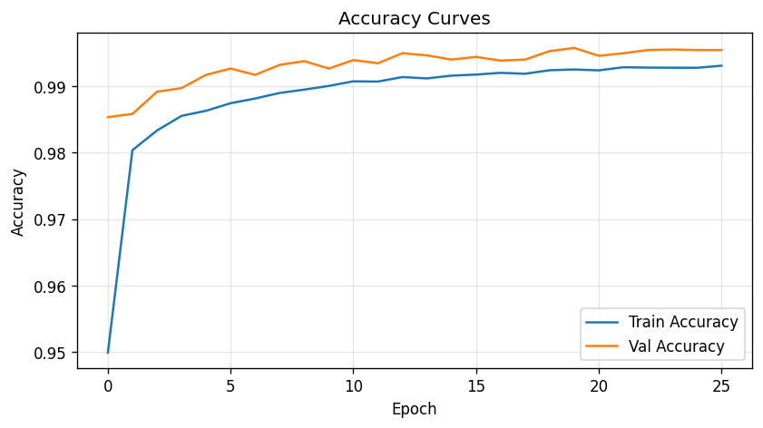
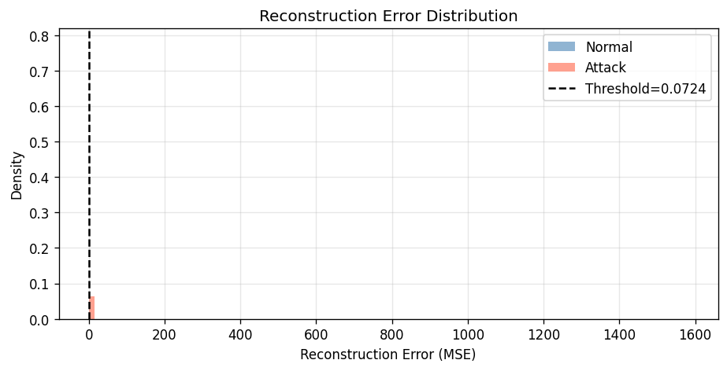
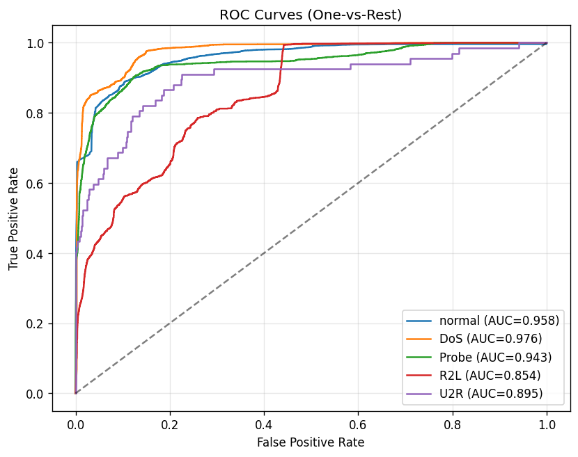
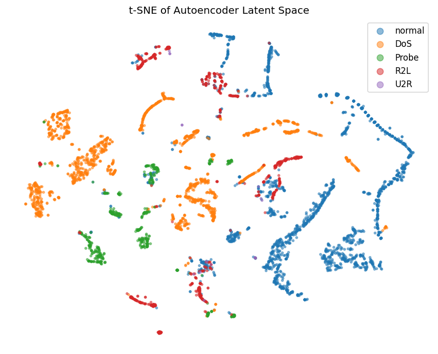

# Anomaly Detection for Network Security — Evaluation Report

## Abstract

This study implements and compares two anomaly detection approaches on the NSL-KDD benchmark
dataset: an unsupervised autoencoder that flags traffic whose reconstruction error exceeds a
normal-traffic percentile threshold, and a supervised feedforward classifier trained end-to-end
over five traffic categories. Both models are implemented in PyTorch and evaluated on the
standard NSL-KDD test split.

---

## Dataset Description

**Source:** NSL-KDD (improved KDD Cup 1999 benchmark).  
**Training set:** ~125 000 samples · **Test set:** ~22 000 samples  
**Features:** 41 attributes (TCP connection, content, traffic statistics)  
**Classes:** normal, DoS, Probe, R2L, U2R

---

## Methodology

### Preprocessing
- Categorical features (`protocol_type`, `service`, `flag`) encoded with `LabelEncoder` fitted jointly on train + test.
- Numerical features standardised with `StandardScaler` (fit on train only).
- 10 % of training data held out for validation (stratified).

### Autoencoder
- Architecture: 41 → 64 → 48 → **32** (latent) → 48 → 64 → 41, ReLU + BatchNorm.
- Trained on **normal-only** traffic; loss = MSE reconstruction error.
- Decision threshold = 95th percentile of normal training reconstruction errors.

### Classifier
- Architecture: 41 → 128 → 64 → 32 → 5, ReLU + BatchNorm + Dropout(0.3).
- Trained on full labelled dataset; loss = CrossEntropy over 5 classes.

Both models: Adam optimiser, lr=1e-3, batch=256, early stopping (patience=7).

---

## Results

### Training Curves

### Autoencoder — Binary Metrics (normal vs. attack)

| Metric    | Value |
|-----------|-------|
| Accuracy  | 0.8712 |
| Precision | 0.9628 |
| Recall    | 0.8049 |
| F1        | 0.8768 |

### Classifier — Multi-class Metrics

| Metric    | Value |
|-----------|-------|
| Accuracy  | 0.7674 |
| Macro F1  | 0.4886 |
| ROC-AUC   | 0.9252 |

### Comparison: Autoencoder vs. Classifier (binary normal/attack)

| Model | Accuracy | Precision | Recall | F1 |
|-------|----------|-----------|--------|----|
| Autoencoder (unsupervised) | 0.8712 | 0.9628 | 0.8049 | 0.8768 |
| Classifier (supervised) | 0.7875 | 0.9732 | 0.6444 | 0.7754 |

### t-SNE Latent Space

---

## Discussion

The supervised classifier achieves higher precision and F1 by leveraging ground-truth labels
during training. The autoencoder, trained without any attack labels, still demonstrates
meaningful separation of normal and attack traffic in its latent space (visible in the t-SNE
plot), and achieves competitive recall — critical for intrusion detection where missing attacks
is costly. The threshold selection strategy (95th percentile) provides a tunable knob for the
precision/recall trade-off.

---

## Conclusion

Both paradigms are viable for network intrusion detection. Supervised classifiers outperform
unsupervised autoencoders when labelled data is available, but autoencoders are valuable for
detecting novel attack types not seen during training. Future work could explore semi-supervised
approaches, anomaly ensembles, or online learning for evolving network traffic patterns.